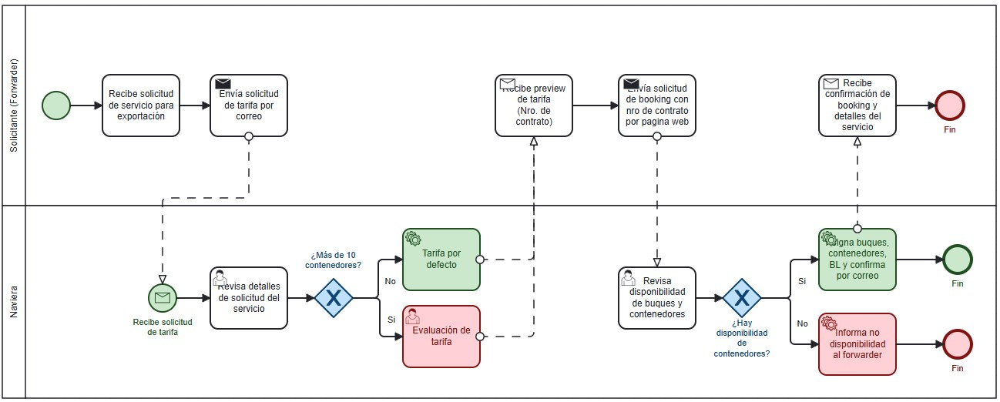

# Proceso de negocio — AS-IS
 
## Macro-proceso y proceso específico
**Gestión de Operaciones Navieras y Logística Marítima** → **Proceso de Cotización, Validación de Disponibilidad y Confirmación de Booking**
 
## Objetivo de negocio del proceso
Gestionar la recepción de solicitudes de reserva de espacio en buques portacontenedores para fechas específicas, verificando la disponibilidad de capacidad de carga y confirmando las reservas a los clientes.
 
## Participantes y sus objetivos
| Participante | Objetivo en el proceso |
|---------------|------------------------|
|**Solicitante (Forwarder)** | Enviar la solicitud de servicio de exportación, obtener la vista previa de la tarifasegún la cantidad de contenedores y recibir la confirmación final de *booking* con los detalles del servicio. |
| **Naviera**|Revisar las solicitudes de tarifa, evaluar el costo según el volumen de contenedores, verificar la disponibilidad de buques y espacio de contenedores, y confirmar la asignación o informar la no disponibilidad.] |
 
## Diagrama AS-IS

 
Archivo fuente: [`./diagramas/as-is.bpmn`](./diagramas/as-is.bpmn)
 
## Problemas identificados
- 
- [Problema 2]

