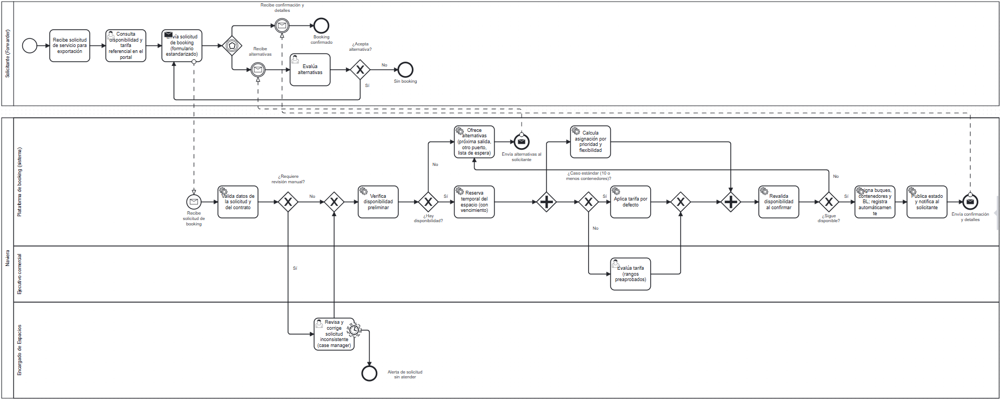

# Análisis de rediseño y propuesta TO-BE

Proceso: solicitud de booking de exportación entre el Solicitante (Forwarder) y la Naviera.
Heurísticas: Reijers y Liman Mansar (2005), *Best practices in business process redesign*.
Efectos evaluados con el "devil's quadrangle" (tiempo, costo, calidad, flexibilidad).

## Mejoras identificadas por participante

| Participante | Objetivo | Problema | Mejora deseada |
|----------------|----------|----------|-----------------|
| Solicitante (Forwarder) | Solicitar en forma autónoma, eficiente y sin fricciones | No ve la disponibilidad de espacios | Portal con disponibilidad de buques y contenedores en línea, para elegir sin esperar respuesta |
| Solicitante (Forwarder) | Solicitar en forma autónoma, eficiente y sin fricciones | Depende de que el encargado revise su correo | Solicitud en un sistema único con notificaciones, alertas de atención y estado visible |
| Solicitante (Forwarder) | Solicitar en forma autónoma, eficiente y sin fricciones | Demasiados contactos por canales distintos (tarifa por correo, booking por web, confirmación por correo) | Una sola interacción con formulario estandarizado, que reúna tarifa y booking |
| Solicitante (Forwarder) | Solicitar en forma autónoma, eficiente y sin fricciones | Si no hay disponibilidad el proceso termina sin alternativas | Ofrecer alternativas: próxima salida, otro puerto o lista de espera |
| Solicitante (Forwarder) | Solicitar en forma autónoma, eficiente y sin fricciones | No hay seguimiento de estado ni un responsable visible por solicitud | Estado publicado en el portal y un responsable (case manager) por solicitud |
| Encargado de Espacios (Naviera) | Optimizar el uso de espacios sin conflictos | Puede recibir múltiples solicitudes del mismo recurso al mismo tiempo, sin regla de priorización | Reserva temporal con vencimiento, revalidación al confirmar y asignación por prioridad |
| Encargado de Espacios (Naviera) | Optimizar el uso de espacios sin conflictos | Posible error en el registro manual de asignaciones | Asignación y registro automáticos de buques, contenedores y BL |
| Encargado de Espacios (Naviera) | Optimizar el uso de espacios sin conflictos | La disponibilidad se revisa tarde, después de gestionar la tarifa, y el esfuerzo se pierde si no hay espacio | Verificar disponibilidad antes de evaluar la tarifa |
| Encargado de Espacios (Naviera) | Optimizar el uso de espacios sin conflictos | "Evaluación de tarifa" es un cuello de botella manual en los casos de más de 10 contenedores | Tarifa por defecto automática y evaluación manual solo en excepciones, con rangos preaprobados |
| Encargado de Espacios (Naviera) | Optimizar el uso de espacios sin conflictos | "Revisa detalles de solicitud" es una revisión manual sin validación previa | Validación automática de datos; revisión manual solo de casos inconsistentes |

## Iniciativas de rediseño

### Iniciativa 1
- Actividad(es) del AS-IS que afecta: "Revisa disponibilidad de buques y contenedores" (Naviera) y "Recibe preview de tarifa (Nro. de contrato)" (Solicitante)
- Heurística aplicada: Control relocation (mover los controles hacia el cliente), junto con Integration
- Objetivo o mejora que resuelve: el solicitante no ve la disponibilidad de espacios; autonomía del solicitante
- Efecto esperado (tiempo/costo/calidad/flexibilidad): baja el tiempo y el costo, y mejora la calidad porque hay menos solicitudes rechazadas. Riesgos: reservas sin intención real de uso y mayor dependencia mutua, que reduce la flexibilidad.

### Iniciativa 2
- Actividad(es) del AS-IS que afecta: "Envía solicitud de tarifa por correo", "Recibe preview de tarifa (Nro. de contrato)" y "Envía solicitud de booking con nro de contrato por página web"
- Heurística aplicada: Contact reduction
- Objetivo o mejora que resuelve: solicitar sin fricciones, con una sola interacción en vez de tres contactos
- Efecto esperado (tiempo/costo/calidad/flexibilidad): baja el tiempo de respuesta y los errores de traspaso de información. Riesgo: pérdida de información si se unifica demasiado.

### Iniciativa 3
- Actividad(es) del AS-IS que afecta: "Envía solicitud de booking con nro de contrato por página web" y "Revisa detalles de solicitud del servicio"
- Heurística aplicada: Interfacing (interfaz estandarizada con clientes y socios)
- Objetivo o mejora que resuelve: solicitud sin fricciones y menos errores de datos
- Efecto esperado (tiempo/costo/calidad/flexibilidad): mejora la calidad (menos solicitudes incompletas), y baja el tiempo y el reproceso.

### Iniciativa 4
- Actividad(es) del AS-IS que afecta: "Revisa detalles de solicitud del servicio" y "Revisa disponibilidad de buques y contenedores", que dependen de que el encargado revise su correo
- Heurística aplicada: Order-based work (eliminar el procesamiento por lotes y las actividades periódicas)
- Objetivo o mejora que resuelve: la dependencia de que el encargado revise el correo
- Efecto esperado (tiempo/costo/calidad/flexibilidad): baja el tiempo de espera de cada solicitud, que pasa a una cola con notificación y alerta por falta de atención. Riesgo: costo de mantener el sistema disponible de forma permanente.

### Iniciativa 5
- Actividad(es) del AS-IS que afecta: todo el intercambio por correo, incluida "Asigna buques, contenedores, BL y confirma por correo"
- Heurística aplicada: Integral technology
- Objetivo o mejora que resuelve: visibilidad de la disponibilidad y del estado para ambos participantes; menos dependencia del correo
- Efecto esperado (tiempo/costo/calidad/flexibilidad): mejora tiempo y calidad con datos compartidos. Riesgos: costo de implementación, capacitación y resistencia al cambio.

### Iniciativa 6
- Actividad(es) del AS-IS que afecta: "Revisa detalles de solicitud del servicio"
- Heurística aplicada: Task elimination
- Objetivo o mejora que resuelve: carga manual del encargado y solicitud eficiente
- Efecto esperado (tiempo/costo/calidad/flexibilidad): baja tiempo y costo, porque las validaciones pasan al formulario. Riesgo: pérdida de calidad si la validación automática no cubre todos los casos, por eso los inconsistentes pasan a revisión manual.

### Iniciativa 7
- Actividad(es) del AS-IS que afecta: "Revisa disponibilidad de buques y contenedores" y "Asigna buques, contenedores, BL y confirma por correo"
- Heurística aplicada: Task automation
- Objetivo o mejora que resuelve: error en el registro manual de asignaciones
- Efecto esperado (tiempo/costo/calidad/flexibilidad): baja el tiempo y mejora la calidad al eliminar errores manuales. Riesgos: costo de desarrollo y menor flexibilidad ante casos atípicos.

### Iniciativa 8
- Actividad(es) del AS-IS que afecta: "Asigna buques, contenedores, BL y confirma por correo" (actividad nueva de revalidación antes de asignar)
- Heurística aplicada: Control addition
- Objetivo o mejora que resuelve: conflictos por solicitudes simultáneas del mismo recurso
- Efecto esperado (tiempo/costo/calidad/flexibilidad): mejora la calidad (no se confirman dos asignaciones sobre el mismo recurso). Consume un poco de tiempo y de recursos del sistema.

### Iniciativa 9
- Actividad(es) del AS-IS que afecta: "Revisa disponibilidad de buques y contenedores" y "Asigna buques, contenedores, BL y confirma por correo"
- Heurística aplicada: Triage / Order types, junto con Flexible assignment (más una reserva temporal con vencimiento)
- Objetivo o mejora que resuelve: cómo priorizar múltiples solicitudes del mismo recurso; uso óptimo de espacios sin conflictos
- Efecto esperado (tiempo/costo/calidad/flexibilidad): mejora la calidad y la utilización de recursos, y da más flexibilidad para asignaciones futuras. Riesgo: demasiada especialización complica el proceso. Los criterios de prioridad (tipo de cliente o contrato, volumen, urgencia) son un supuesto y deben definirse con el negocio.

### Iniciativa 10
- Actividad(es) del AS-IS que afecta: "Evaluación de tarifa", "Tarifa por defecto" y el gateway "¿Más de 10 contenedores?"
- Heurística aplicada: Exception (aislar los casos excepcionales) y Empower (delegar decisión dentro de rangos preaprobados)
- Objetivo o mejora que resuelve: cuello de botella en la evaluación manual de tarifa
- Efecto esperado (tiempo/costo/calidad/flexibilidad): baja el tiempo y el costo, porque solo los casos excepcionales pasan por evaluación del ejecutivo comercial. Riesgo: decisiones de menor calidad si los rangos preaprobados no están bien definidos.

### Iniciativa 11
- Actividad(es) del AS-IS que afecta: orden entre "Evaluación de tarifa" y "Revisa disponibilidad de buques y contenedores"
- Heurística aplicada: Resequencing, con Knock-out (ordenar primero la verificación barata con mayor probabilidad de descartar)
- Objetivo o mejora que resuelve: esfuerzo perdido al gestionar una tarifa para un servicio sin disponibilidad
- Efecto esperado (tiempo/costo/calidad/flexibilidad): baja el costo y el tiempo, porque se descarta antes. Riesgo: la disponibilidad puede cambiar mientras se evalúa la tarifa, lo que se cubre con la reserva temporal.

### Iniciativa 12
- Actividad(es) del AS-IS que afecta: "Evaluación de tarifa" y "Revisa disponibilidad de buques y contenedores", que hoy son secuenciales
- Heurística aplicada: Parallelism
- Objetivo o mejora que resuelve: eficiencia; menor tiempo total del proceso
- Efecto esperado (tiempo/costo/calidad/flexibilidad): baja el tiempo de ciclo. Puede subir el costo si la disponibilidad descarta el caso, y hace más complejo el control del flujo. En el TO-BE la tarifa corre en paralelo con el cálculo de asignación, después de la verificación preliminar de disponibilidad.

### Iniciativa 13
- Actividad(es) del AS-IS que afecta: "Informa no disponibilidad al forwarder"
- Heurística aplicada: Exception, junto con Integration
- Objetivo o mejora que resuelve: solicitar sin fricciones; hoy, sin disponibilidad, el proceso termina sin alternativas
- Efecto esperado (tiempo/costo/calidad/flexibilidad): mejora la calidad del servicio y la flexibilidad para el solicitante, con costo de gestionar alternativas y una lista de espera. Es una aplicación de estas heurísticas, no una práctica formulada así en el artículo.

### Iniciativa 14
- Actividad(es) del AS-IS que afecta: "Revisa detalles de solicitud del servicio" y "Recibe confirmación de booking y detalles del servicio"
- Heurística aplicada: Case manager
- Objetivo o mejora que resuelve: falta de seguimiento y de un responsable visible por solicitud
- Efecto esperado (tiempo/costo/calidad/flexibilidad): mejora la calidad y la satisfacción del solicitante, con un único punto de responsabilidad. Cuesta capacidad dedicada del encargado.
 
## Diagrama TO-BE

 
Archivo fuente: [`./diagramas/to-be.bpmn`](./diagramas/to-be.bpmn)
 
Nota: distingan tareas de usuario, de servicio y manuales con el marcador correspondiente.

## Actividades que cambian del AS-IS al TO-BE

| Actividad en el AS-IS | Actividad en el TO-BE | Qué cambia |
|-------------------------|--------------------------|------------|
| Recibe solicitud de servicio para exportación | Recibe solicitud de servicio para exportación | Sin cambio |
| Envía solicitud de tarifa por correo | Consulta disponibilidad y tarifa referencial en el portal | Ya no se pide por correo: el solicitante consulta él mismo la disponibilidad y la tarifa en el portal |
| Recibe preview de tarifa (Nro. de contrato) | (Eliminada) | La tarifa se ve en el portal; no hay intercambio ni reenvío del número de contrato |
| Envía solicitud de booking con nro de contrato por página web | Envía solicitud de booking (formulario estandarizado) | Una sola interacción, con formulario estandarizado y campos obligatorios |
| Recibe solicitud de tarifa (inicio de la Naviera) | Recibe solicitud de booking (inicio de la Naviera) | El proceso de la naviera parte de la solicitud de booking recibida en la plataforma |
| Revisa detalles de solicitud del servicio (manual) | Valida datos de la solicitud y del contrato (automática) y Revisa y corrige solicitud inconsistente (case manager) | La validación pasa al sistema; el encargado revisa solo los casos inconsistentes, con alerta si no se atienden |
| ¿Más de 10 contenedores? | ¿Caso estándar (10 o menos contenedores)? | Se mantiene el criterio, pero ahora corre en paralelo con el cálculo de asignación |
| Tarifa por defecto | Aplica tarifa por defecto | Sin cambio funcional, pero corre en paralelo con el cálculo de asignación |
| Evaluación de tarifa | Evalúa tarifa (rangos preaprobados) | Solo los casos excepcionales, con autoridad delegada dentro de rangos, y en paralelo con la asignación |
| Revisa disponibilidad de buques y contenedores (manual, después de la tarifa) | Verifica disponibilidad preliminar (automática, antes de la tarifa), Reserva temporal del espacio y Revalida disponibilidad al confirmar | Se automatiza y pasa al inicio; se agrega reserva temporal con vencimiento y una revalidación antes de asignar |
| ¿Hay disponibilidad de contenedores? | ¿Hay disponibilidad? y ¿Sigue disponible? | Dos verificaciones: una preliminar y otra al confirmar |
| Informa no disponibilidad al forwarder | Ofrece alternativas (próxima salida, otro puerto, lista de espera) y Evalúa alternativas (Solicitante) | En vez de terminar, se ofrecen alternativas al solicitante, que puede aceptar una y reintentar |
| (No existía) | Calcula asignación por prioridad y flexibilidad | Nueva regla de priorización para solicitudes simultáneas del mismo recurso |
| Asigna buques, contenedores, BL y confirma por correo | Asigna buques, contenedores y BL; registra automáticamente y Publica estado y notifica al solicitante | Asignación y registro automáticos; la confirmación y el estado se publican en el portal y se notifican, sin depender del correo |
| Recibe confirmación de booking y detalles del servicio | Recibe confirmación y detalles | Llega por el portal y la notificación, con estado visible y un responsable por solicitud |

